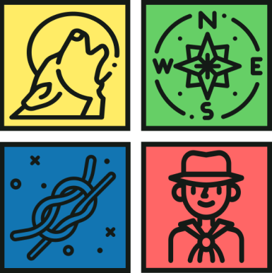

# Escutas

## Repository Structure

- *documentation*: includes project documentation - such as the report;
- *presentation*: contains a formal presentation of the project;
- *source*: incorporates the Android application source code.

## Working Group

- Jonas Andrade - <a10506@alunos.ipca.pt>
- Ivo Gomes - <a10700@alunos.ipca.pt>
- Hugo Gonçalves - <a11600@alunos.ipca.pt>
- Tiago Oliveira - <a21585@alunos.ipca.pt>
